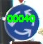
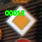
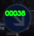
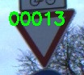
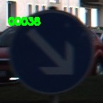
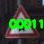

# Traffic-Signs-CNN-Classification
Use convolutional neural networks to detect traffic signs using both shallownet and lenet networks.

**Richard Mao**\
**1/31/2018**

Code:
[*https://github.com/Rmao99/Traffic-Signs-CNN-Classification*](https://github.com/Rmao99/Traffic-Signs-CNN-Classification)

**Background**: Ever since watching AlphaGo, an AI trained through
neural networks, beat the reigning world champion Lee Sedol in a game of
Go, I had been captivated by the wonders of AI. I immediately jumped at
the opportunity to immerse myself in this field, but found myself stuck
at a very theoretical level, learning with no physical application.
However after multiple failed attempts, I finally managed to work on a
personal project and accomplish my dream of training my first neural
network. My neural network is a type called a convolutional neural
network, which is great for image classification.

**Image Selection:** While I was tempted to choose classification on
animals, I decided to create a traffic sign classifier to build off of
my work at SEAP. Deciding on a traffic sign classifier, I found a
Belgium Traffic Sign Dataset consisting of thousands of images of 62
different types of traffic signs of varying sizes, lighting, and angles.
I eventually switched to a German Traffic Sign Dataset which consisted
of over 12,000 images of 43 different types of traffic signs.

**Structure:** With the images, I first split the data into training and
testing sets, scaling all images to the same size, before feeding it
into my neural network. I had to tune multiple parameters, including
changing the complexity of my network itself. The ability for CNNs to
build high-level features off of smaller ones in an automated fashion is
what makes the classification so powerful.

**Shallow Net:** The first convolutional neural network I learned was
very simple (hence shallow), but still yielded good result. The general
structure of the Shallow Net implementation is Input Image Layer -&gt;
Conv -&gt; ReLU -&gt; FC.

1.  Input Image Layer: A 32x32x3 image. The image is 32x32 pixels and
    > has 3 channels (Red, Green Blue)

2.  Convolution Layer (Conv): This layer loops through the whole 32x32
    > image and takes sections of it to compare. The closer a particular
    > section matches the feature, the greater the value assigned (and
    > thus the greater the weight). In this case, I define 32 different
    > filters each of size 3x3 pixels to loop through the image.

3.  Rectified Linear Units(ReLU): This is not technically a layer
    > because it does not include weights/parameters, but is an
    > activation function that turns every value that is a negative
    > number into 0, and keeps the rest the same. This keeps the
    > mathematical computations from breaking.

4.  Fully Connected Layer(FC): This final fully connected layer results
    > in a one dimensional array that has the same size as the number of
    > image labels (in this case 43) that holds the value of the
    > probabilities in each cell.

With this model, providing it input images from the Belgium Dataset
resulted in an accuracy of 93%. (next to the “avg/total” label).

\
\
The data is split into two parts, training and value. The curves
produced from the training loss and accuracy graphs are from the actual
training data itself. However the curves produced from the value graph
represent how accurate the model is at predicting testing images (images
the network has not been trained on). So while the training accuracy
nears 100% and the training loss nears 0%, the value loss and accuracy
are not as close.\
\
On further inspection, the Belgium Traffic Sign Dataset was actually
missing images in some of its labels, resulting in 0.00% precision for
those images (because there were no images to evaluate the model on)!
This prompted me to switch to the German Traffic Sign Dataset, which,
while it had less unique signs, had a plethora of data available.\
\
With this new dataset and same convolutional neural network model, the
classifier then achieved 95% accuracy.

**LeNet :** I decided at this point to upgrade the network to achieve
better results. 95% accuracy is good but not quite there. This format 
can be summarized as Input Image Layer -&gt; Conv-&gt; ReLU -&gt; Pool 
-&gt; Conv -&gt; ReLU -&gt; Pool -&gt; FC -&gt; ReLU -&gt; FC.

This structure adds a lot more complexity, mainly repeating the
Conv-&gt;ReLU section twice. It also includes pooling, which adds a
layer after each ReLU activation. This layer gives the network a lot of
flexibility. Essentially it shrinks all the filters down, not only
making the data more manageable, but also creating more local invariance
that makes CNNs so powerful. Essentially it preserves the largest value
in the window size, ensuring that the network does not care where
exactly the feature is, just the general area.

With a more complex network, I expected the accuracy to increase
dramatically and the loss to decrease significantly, however after
training this network, the accuracy was actually lower than before at
93%.\
\
Looking at the graph reveals why. Initially the training was going well:
The value loss was decreasing as expected-albeit a bit rough. However,
after around 30 epochs (30 iterations), the data started to overfit (the
gap between value loss and training loss increases). This is not a good
sign, as it means the classification eventually loses its ability to
generalize as it trains more.\
\
I decided to add rate decay to the code as well as a few other small
optimizations to such as momentum and Nesterov’s acceleration. The rate
decay is a gradual decrease in learning rate as the training progresses
along. Since learning rate can be thought of as the “step size” one
takes along the gradient (the direction that leads to lower loss),
constantly having a large learning rate can result in overstepping the
areas of low loss. As a result, adding a decay in which the learning
rate decreases as training progresses reduces overfitting and improves
generalization/accuracy.\
\
Creating a training monitor, I was able to monitor my training progress
better while it was in the middle of training instead of waiting hours
until it finished training. As a result of this change, the network
achieved 98% accuracy. The value loss also decreased much more smoothly
in this case.

I decided to further implement Batch Normalization, which is a useful
technique that “normalizes” previous activations. It further lowers
overfitting because it acts like a regulator by reducing how much the
hidden layer values can change.\
\
With this implemented, the accuracy of the classifier finally improved
to 99%. The final classifier is the .hdf5 file\

**Example Tests:**

     

*Note: The labels on these images go from 00000 - 00042. 00000
corresponds to the first sign type, 00001 corresponds to the second sign
type, etc. The list of signs on the first page is in this order. This
labeling is due to how the German Traffic Signs Dataset is labeled in
the same way.*
